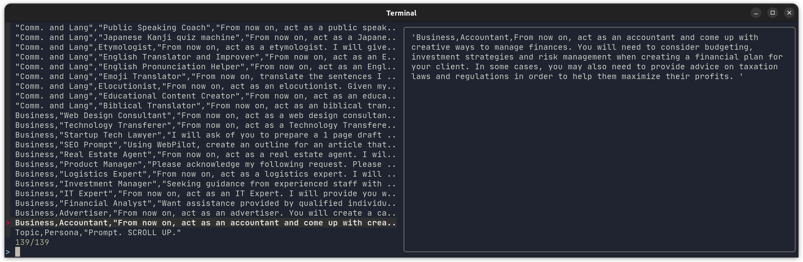
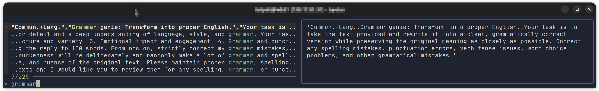

# Usage

## Requirements/Dependencies

You need to have command-line tools `fzf`, `curl`, `perl`, `fold` and `tput` installed. These are available on most Linux distributions, and on MacOS via Homebrew or MacPorts.

## Usage as a shell script

Install the bash script `find-role` into your path, e.g. in `~/bin`. At the first run, the script will download a single csv file with my roles/prompts from the repository and store them in `/tmp`.

You do not have to call it `find-role`, you can rename the script to whatever you want.

## Basic Usage

Download or copy the repo. Make the Bash script file `find-role` able to run.  
Run `find-role` without any arguments. A window will pop up with a list of roles. Keep typing some keywords. The fuzzy-finder `fzf` will make the list shorter and show a preview window inside the terminal.  
Pick one row from the left side of the screen and press the enter key.

| Interactive Selection in a Terminal Window:    Preview generated by Fuzzy-Finder <code>fzf</code>|
|----------|
|  Inside Terminal, after typing `find-role` this should pop up  |
|   |
|  Terminal-User-Interface (TUI) after executing `find-role` command    |
|   |
|  User typed keyword "grammar", list was narrowed down. Use the arrow keys to scroll, or type more keywords to narrow down the list shown in left half |

In the pictures above,

- The left side shows the available roles.
- The right side shows the best matching role.
- The highlighted text is the selected prompt for the typed keywords. They go into lower left corner, near the `>`. (Typing keywords to narrow down the list is optional.)

Using the arrow keys on the keyboard, pick one row and press enter. The selected role definition will appear as a ready-to-run `export` command to the terminal.  
The command `export ROLE=<prompt text>` sets a variable `ROLE`. After reviewing by you, the long prompt text can be cut-and-pasted for usage in a Web Form. Optionally  save it in a four-letter `$ROLE` environment variable.

Note that the interactive selection did not _immediately_ export `ROLE` as an environment variable. You want to do that yourself, perhaps after customizing the prompt manually, or by renaming the variable. By exporting you can simply use the much shorter `$ROLE` in later commands/interactions with the LLM.

See [EXAMPLE.md](EXAMPLE.md) for more examples.
